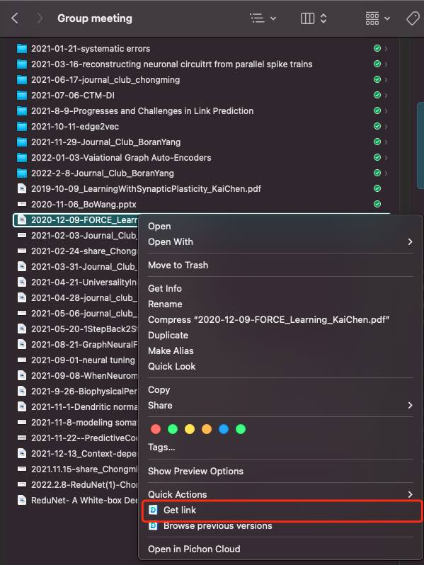
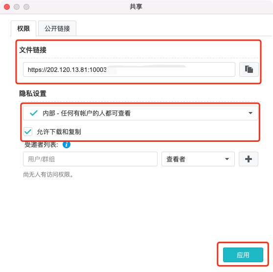

# Instructions: Adding a New Journal Club

## Adding Journal Club Schedule

Simply create a list entry to JC YAML file, `_data/meeting_info.yml`.

The website will recognize the key-value pairs you provided to generate the schedule table automatically.

- `presenter` (your full name)
- `date` (date of JC, please use the format `YYYY-MM-DD HH:MM:SS`)
- `paper` (paper you're gonna to present)
- `url` (link to find the paper)
- `pdf` (link to paper pdf)
- `author` (authors of the paper)
- `pdf` (optional)
- `slides` (required, may uploaded after JC)

Here's an example.

```yaml
- presenter: Joe Biden
  date: 2022-02-14 20:00:00
  paper: Can Quantum-Mechanical Description of Physical Reality Be Considered Complete?
  url: http://link.aps.org/doi/10.1103/PhysRev.47.777
  pdf: https://journals.aps.org/pr/pdf/10.1103/PhysRev.47.777
  authors: Einstein, A. and Podolsky, B. and Rosen, N.
  slides: https://202.120.13.81:10003/d/f/jgfdjksalg;HNUIGIOPewfjagHEheHpqnfioap
```

### Upload slides and share link

1. Upload your slides (better with PDF format) to `/share/Group Meeting/` in our Synology Drive with filename `YYYY-MM-DD-{slides title}-{yourname}.pdf`

2. Then open the link generation page. <br/>
  

3. Copy the shared **link** and click **Apply** to generate the link. **Please set the privacy settings to Internel**, as shown in the figure below.<br/>
  

## Adding Journal Club Summary

To add a new summary of your JC, please create a markdown to the folder `_posts` with filename `YYYY-MM-DD-yourname.md`. Then set the following key-value pairs in `Front Matter`.

- `layout: post` (DON'T CHANGE THIS)
- `author`: yourname
- `title`: title of paper you presented
- `date`: the same date you used in `_data/meeting_info.yml`.
- `discription`: use your OWN words to briefly summarize the paper.
- `tags`: add keyswords for your JC if you want. Multiple keywords are seperated by whitespace.

An example is shown below.

```markdown
---
layout: post
author: Joe Biden
title: Can Quantum-Mechanical Description of Physical Reality Be Considered Complete?
date: 2022-02-14 20:00:00
description: 
    In a complete theory there is an element corresponding to each element of reality. A sufficient condition for the reality of a physical quantity is the possibility of predicting it with certainty, without disturbing the system. In quantum mechanics in the case of two physical quantities described by non-commuting operators, the knowledge of one precludes the knowledge of the other. Then either (1) the description of reality given by the wave function in quantum mechanics is not complete or (2) these two quantities cannot have simultaneous reality. Consideration of the problem of making predictions concerning a system on the basis of measurements made on another system that had previously interacted with it leads to the result that if (1) is false then (2) is also false. One is thus led to conclude that the description of reality as given by a wave function is not complete.

tags: physics quantum-mechanics
---

<p>{{page.description}}</p>

```