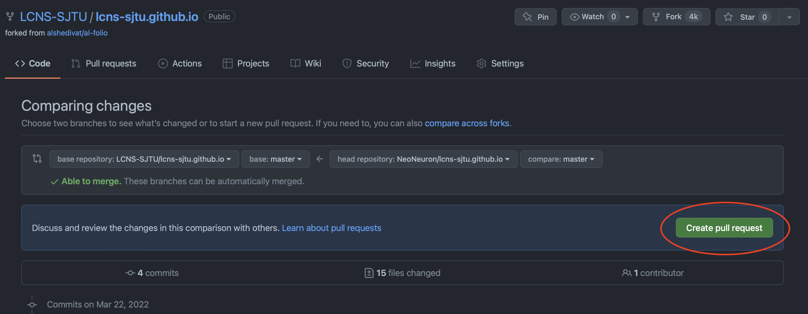

# Instructions: open a pull request

## Open a pull request

1. [Fork](https://guides.github.com/activities/forking/) the repo from `github.com:LCNS-SJTU/lcns-sjtu.github.io` to `github.com:<your-username>/<your-repo-name>`.
2. Commit your change to `github.com:<your-username>/<your-repo-name>`.
3. Open a pull request. 

## Write your PR message

Choose the source and destination branches, and confirm your creation. 

Write your PR message to help admin to review your PR. 

## After your PR reviewed

Once your change reviewed, PR will be closed and your will be noticed. 
